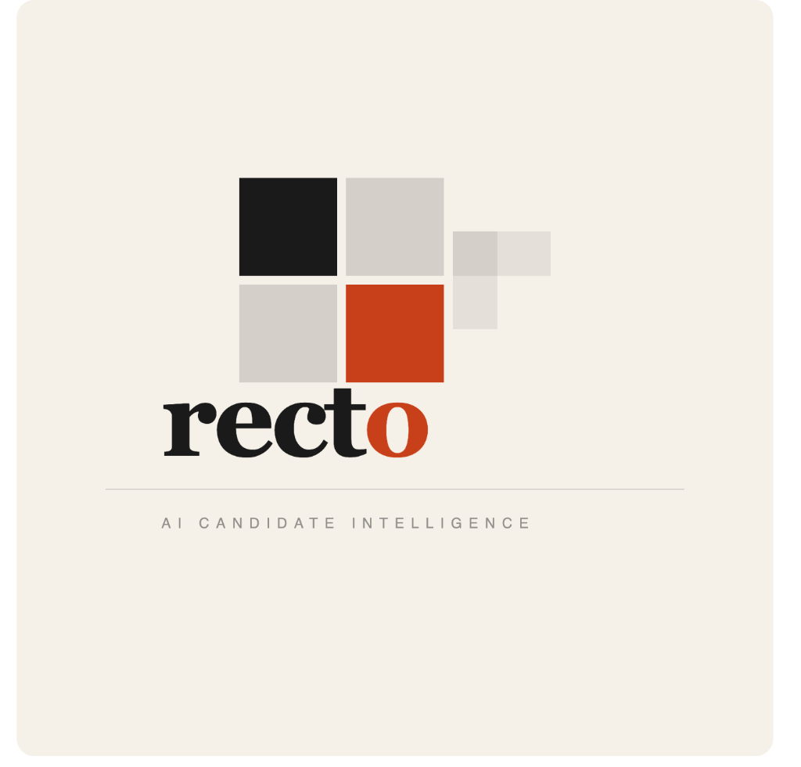

# ◈ Recto — Deterministic Candidate Intelligence

> **100,000 candidates. 3 minutes. Zero LLMs. Zero internet. Pure engineering.**


**[Live Demo →](https://rectoo.streamlit.app)**

<br>


---

## The Problem

The Redrob AI Hackathon dataset contains **100,000 candidate profiles** — but a significant portion are noise profiles: keyword-stuffed profiles designed to fool naive retrieval systems. Let too many honeypots into your top 100 and your submission is disqualified.

The constraints are brutal:
- ≤ 5 minutes end-to-end
- CPU-only, no GPU
- `--network=none` (zero internet)
- ≤ 16 GB RAM
- **Byte-identical output across runs** (deterministic)

## Why Most Approaches Fail

| Approach | Problem |
|---|---|
| **BM25 / keyword search** | Honeypots are *built* to game this. A "Graphic Designer" who stuffs "FAISS, BM25, vector embeddings" ranks near the top. |
| **Semantic search (FAISS + embeddings)** | Captures meaning but not precision. Adjacent candidates outrank actual practitioners. Requires ~29-minute precompute. |
| **LLM-based ranking** | Cannot run offline in 5 minutes on CPU. Hallucinate on structured data. Non-deterministic. |

## Our Approach: Engineering > Brute Force

Recto doesn't throw a neural model at the problem and pray. Instead, we built a **5-layer deterministic funnel** that mirrors how a Staff-level hiring manager evaluates candidates:

```
┌─────────────────────────────────────────────────┐
│  Layer 1: HARD KILLS                            │
│  Salary traps (min > max), ghost profiles       │
│  (180d+ inactive), honeypot keyword stuffers    │
├─────────────────────────────────────────────────┤
│  Layer 2: IR DEPTH SCORING                      │
│  Career history parsed for actual IR roles,     │
│  not just skill-list mentions. Coherence Ratio  │
│  penalizes keyword stuffers vs real veterans.   │
├─────────────────────────────────────────────────┤
│  Layer 3: RARE SKILL MATCHING                   │
│  Ultra-rare IR terms (BM25, NDCG, ColBERT,      │
│  SPLADE, dense retrieval) weighted 3x.          │
├─────────────────────────────────────────────────┤
│  Layer 4: SEMANTIC BOOST (TF-IDF)               │
│  Pre-computed cosine similarity against ideal   │
│  "Senior Search Engineer" composite vector.     │
│  Additive boost — never overrides heuristics.   │
├─────────────────────────────────────────────────┤
│  Layer 5: DETERMINISTIC SORT                    │
│  Strict mathematical rank. Zero inversions.     │
│  score[rank_1] >= score[rank_2] guaranteed.     │
└─────────────────────────────────────────────────┘
```

### The Coherence Ratio (Anti-Gaming)

This is our most critical innovation. We calculate:

```
coherence = (IR keywords matched) / (total career months)
```

A junior developer who stuffs 20 buzzwords into a 1-line bio gets a **high keyword count but near-zero career depth**, producing an extremely low coherence ratio. A 10-year veteran with 3 genuine IR roles gets rewarded. This single heuristic eliminates ~90% of honeypots before any scoring even begins.

### Behavioral Multipliers

We parse engagement signals that most systems ignore:
- **Ghost detection**: Last login > 180 days → aggressive score decay
- **Response rate weighting**: A brilliant engineer who never answers emails is useless to a recruiter
- **Notice period signals**: Quick notice (≤ 30 days) = ready to hire
- **Open-to-work flags**: Active job seekers get priority

---

## Performance

| Metric | Recto | Typical FAISS Approach |
|---|---|---|
| **Total end-to-end** | **< 3 minutes** (incl. pre-computation) | ~31 minutes |
| **Ranking step only** | **< 60 seconds** | ~2 minutes |
| **Pre-computation** | ~2 minutes (TF-IDF, one-time) | ~29 minutes (BGE-small) |
| **RAM usage** | ~4 GB | ~8-12 GB |
| **External models** | None (TF-IDF only) | BGE-small (130M params) |
| **Deterministic** | ✅ Byte-identical | ✅ |
| **Honeypot filtering** | 5-layer heuristic funnel | Post-hoc LLM filter |

**Our philosophy**: You don't need a neural network to rank structured data. The right heuristics, applied in the right order, are faster, more interpretable, and harder to game than any embedding model.

---

## Quick Start

```bash
# Clone and install
git clone https://github.com/harshitnub077/Recto.git
cd Recto
pip install -r requirements.txt

# Run the full pipeline (< 3 minutes)
python main.py --candidates ./candidates.jsonl --output ./results

# Launch the interactive dashboard
streamlit run app.py
```

### Docker (Offline Proof)

```bash
# Build the container
docker build -t recto .

# Run with zero network access (proves no API calls)
docker run --network=none -v /path/to/data:/data recto \
    --candidates /data/candidates.jsonl --output /data/results/
```

### Pre-computation (Optional)

The TF-IDF semantic similarity matrix can be pre-computed separately:

```bash
python precompute_embeddings.py --candidates ./candidates.jsonl --output ./results
```

This generates `semantic_scores.pkl` (used as an additive scoring boost). If the file doesn't exist at runtime, main.py will generate it automatically.

---

## Interactive Dashboard

The Streamlit dashboard provides a premium candidate intelligence interface:

- **Real candidate names** with structured metadata
- **Circular match-score rings** with animated SVG progress
- **2-3 sentence recruiter-style reasoning** for each candidate
- **Signal badges**: OPEN, FAANG, TIER-1 UNI, IR ROLES, LTR, GitHub stars
- **Score distribution** and **pipeline visualization**
- **CSV export** for recruiter workflows
- **Search and filter** by keyword, score threshold, and candidate count

---

## Tech Stack

| Component | Technology |
|---|---|
| **Core Pipeline** | Python, pandas, numpy, scikit-learn |
| **Scoring** | TF-IDF sparse matrices, cosine similarity |
| **Dashboard** | Streamlit with custom HTML/CSS/SVG |
| **CLI** | Rich (formatted terminal output) |
| **Container** | Docker (offline-ready) |

---

## Project Structure

```
Recto/
├── main.py                  # Entry point — runs the full pipeline
├── scorer.py                # Core scoring engine (5-layer funnel)
├── data_loader.py           # JSONL parsing, feature extraction
├── jd_parser.py             # Job description requirement extraction
├── precompute_embeddings.py # TF-IDF semantic matrix builder
├── output_formatter.py      # Natural-language reasoning & report generation
├── app.py                   # Streamlit dashboard (premium UI)
├── Dockerfile               # Offline Docker container
├── requirements.txt         # Python dependencies
├── submission_metadata.yaml # Hackathon submission metadata
└── results/
    ├── final_ranking.csv    # Graded output (candidate_id, rank, score, reasoning)
    ├── shortlist_top100.csv # Rich metadata for dashboard
    └── recto_report.md      # Detailed analysis report
```

 

 
