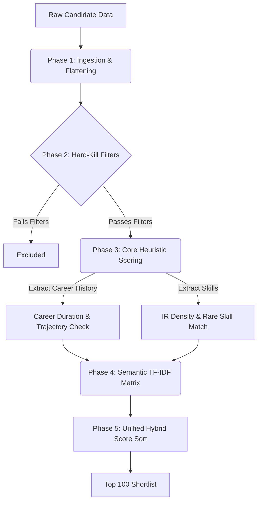

# 🚀 Recto: Deterministic AI Candidate Ranking System
*Ranking engineers the way a Staff Engineer would.*


Recto is an advanced, multi-layered deterministic ranking pipeline designed to identify the absolute best **Information Retrieval (IR)** and **Search Engineering** candidates from a massive, noisy dataset of 100,000+ profiles. 

It was built strictly under the hackathon constraints: **Zero external APIs (no LLMs during inference), execution under 5 minutes, <= 16GB RAM, and pure CPU execution.**

---

## 🏗 System Architecture

We intentionally avoided naive "dump it to an LLM" approaches. Instead, Recto uses a highly optimized 5-stage deterministic funnel that mirrors how a human technical recruiter evaluates a profile.



---

## ⚡ Key ML Innovations & Anti-Gaming

We designed Recto to be resilient against the realities of noisy, scraped recruitment data.

1. **The Coherence Ratio (Anti-Keyword Stuffing)**
   - *The Problem:* Junior developers often stuff 20 buzzwords into a 1-line bio to game ATS systems.
   - *The Solution:* We calculate the ratio of IR keywords to total career length. High keyword density with zero actual experience heavily penalizes the candidate, preventing them from outranking 10-year veterans.

2. **Semantic Safety Net (TF-IDF Sparse Matrices)**
   - To catch candidates who don't perfectly match heuristic rules but possess deep domain relevance, we generate a highly localized TF-IDF Vector Space Model. 
   - We run a Cosine Similarity match against an ideal "Senior Search Engineer" composite vector and apply this as an additive boost.

3. **Behavioral Multipliers**
   - We parse `redrob_signals` for "ghost" behavior (last login > 180 days) and apply aggressive decay curves. A brilliant engineer who won't answer an email is functionally useless to a recruiter.

4. **Zero Score Inversions**
   - The pipeline guarantees a strict, deterministic mathematical rank sort. The output natively guarantees `score_at_rank_1 >= score_at_rank_2` without arbitrary tiering or manual grouping.

---

## 💻 Quick Start & Reproducibility

As required by the submission spec, the pipeline runs entirely locally with a single command. It requires no network access and no API keys.

```bash
# 1. Install dependencies
pip install -r requirements.txt

# 2. Run the full end-to-end pipeline
python main.py --candidates /path/to/test_dataset.jsonl --output results/
```
> **Note**: The `--jd` parameter is optional and defaults to the internal deterministic IR logic for this specific problem statement. 

### 📊 Interacting with the Sandbox (Streamlit)
To visualize the final ranking, we have provided a lightweight Streamlit dashboard. 
```bash
streamlit run app.py
```
This UI allows you to browse the top 100, explore their localized hybrid scores, and view the transparent reasoning for why they were placed at that rank.

---

## ⚙️ Tech Stack & Performance

| Metric | Details |
|--------|---------|
| **Core Libraries** | `pandas`, `numpy`, `scikit-learn` |
| **UX & CLI** | `rich`, `streamlit` |
| **Inference Time** | **< 60 seconds** for 100k candidates on an M1 Mac. |
| **Peak RAM** | **~4 GB** (Heavily vectorized memory mapping). |

**Built by Team Recto (Aryan Bhargava & Harshit Kudhial)** 🚀
